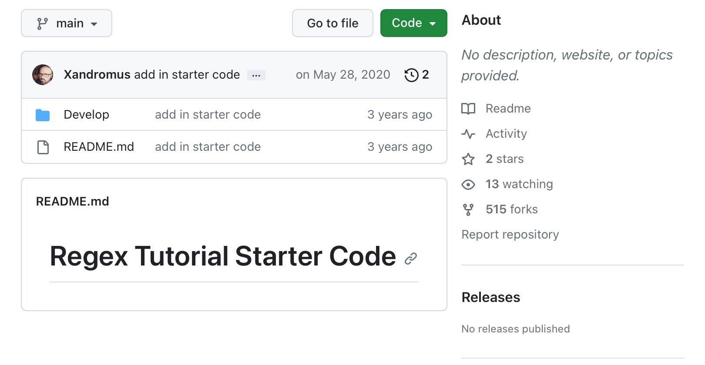
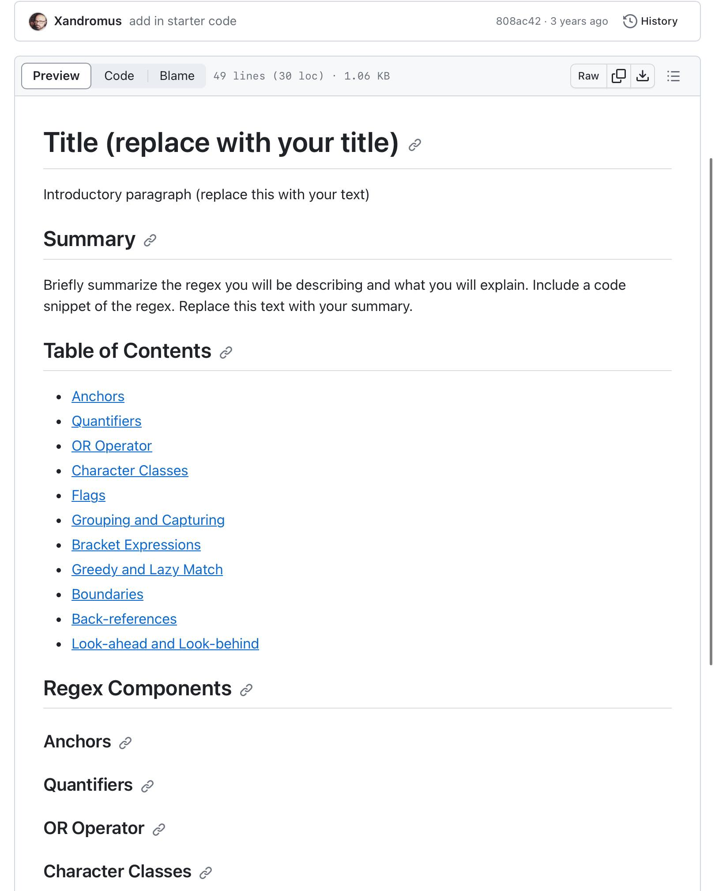
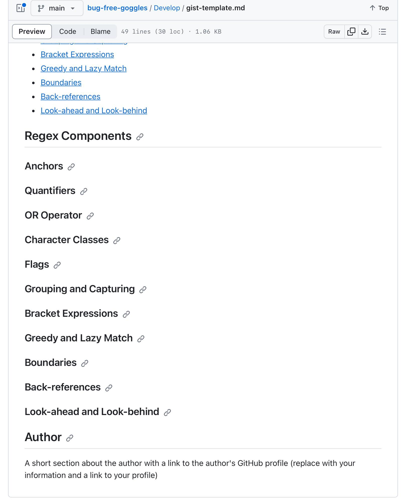
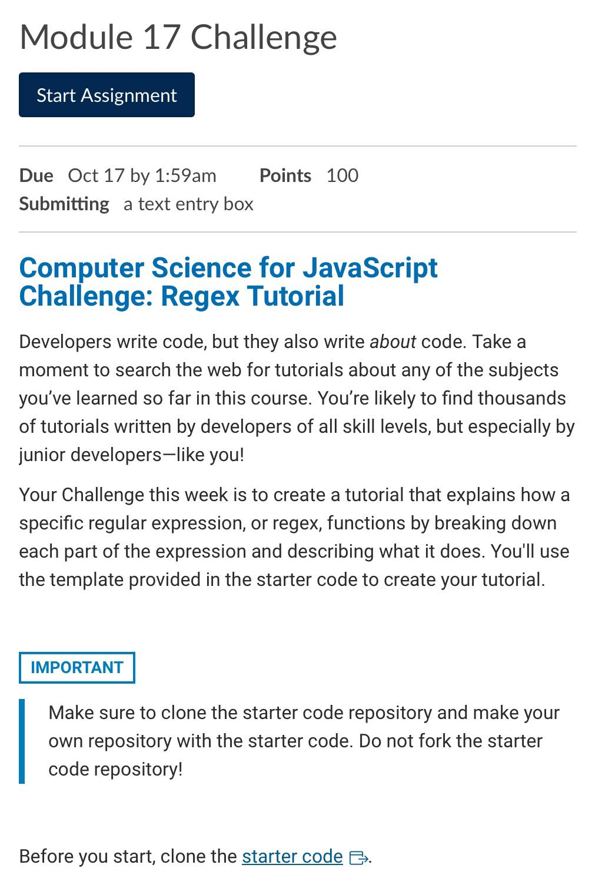
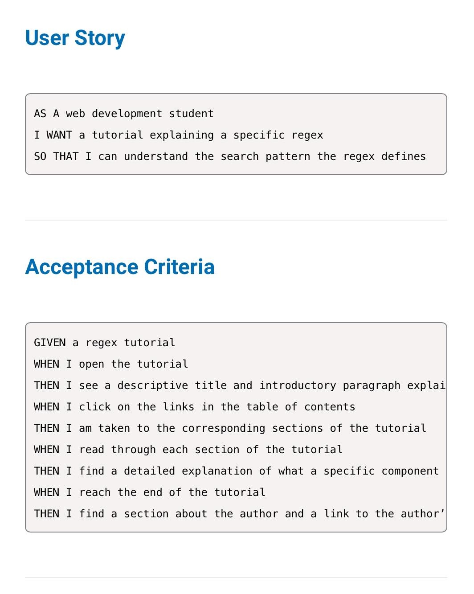
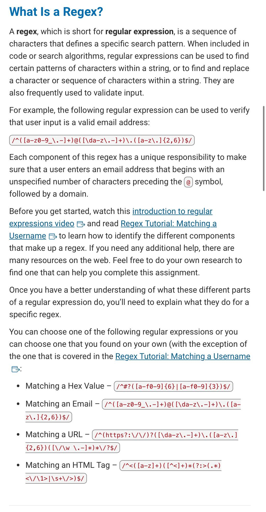
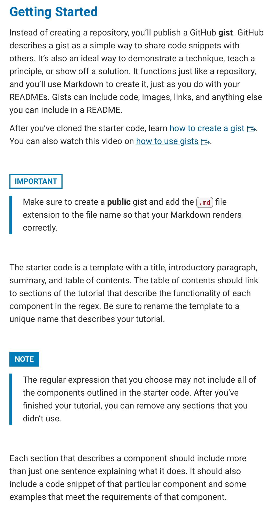
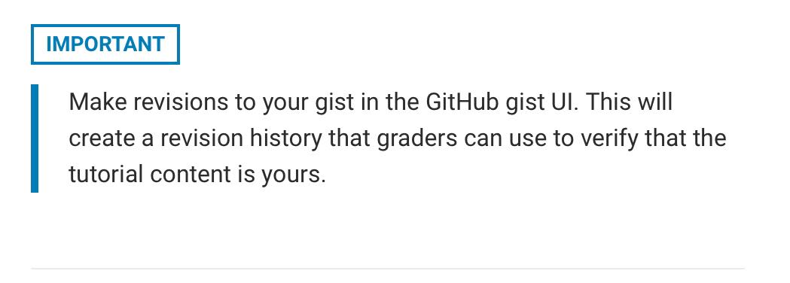

# module-seventeen-project-computer-science-challenge-regex

Tutorial that explains how a specific regular expression, or regex, functions by breaking down each part of expression describing what it does.

## Description

## Table of Contents

- [Installation](#installation)
- [Usage](#usage)
- [Starter Code](#starter-code)
- [Gists](#gists)
- [Regex](#regex)
- [Credits](#credits)
- [License](#license)
- [How to Contribute](#how-to-contribute)
- [Badges](#badges)
- [Tests](#tests)
- [Features](#features)

## Installation

Github link: https://github.com/pmastropolo/module-seventeen-project-computer-science-challenge-regex

Portfolio Website Link:

## Usage

Github link: https://github.com/pmastropolo/module-seventeen-project-computer-science-challenge-regex

Portfolio Website Link:

## Starter Code

I was given Starter Code for this Project.

Link:

- [Starter Code Link](https://github.com/coding-boot-camp/bug-free-goggles)

Images:

## Gists

- [How to Create a Gist](https://docs.github.com/en/get-started/writing-on-github/editing-and-sharing-content-with-gists/creating-gists)
- [How to use Gists](https://www.youtube.com/watch?v=wc2NlcWjQHw)

## Regex

### What is a Regex?

A regex, which is short for regular expression, is a sequence of characters that defines a specific search pattern.

Links:

- [Regular Expression Tutorial](https://coding-boot-camp.github.io/full-stack/computer-science/regex-tutorial)
- [Introduction to Regular Expressions - Programming with Text](https://www.youtube.com/watch?v=7DG3kCDx53c)

## School Links

- [Global Execution Context](https://developer.mozilla.org/en-US/docs/Web/JavaScript/Reference/Operators/this#global_context)
- [Functional Execution Context](https://developer.mozilla.org/en-US/docs/Web/JavaScript/Reference/Operators/this#function_context)
- [Data Structures](https://en.wikipedia.org/wiki/Data_structure)
- [Event Loops](https://developer.mozilla.org/en-US/docs/Web/JavaScript/Event_loop#event_loop)
- [Higher Order Functions](https://eloquentjavascript.net/05_higher_order.html#h_xxCc98lOBK)
- [Closures](https://developer.mozilla.org/en-US/docs/Web/JavaScript/Closures)
- [Composition over inheritance](https://en.wikipedia.org/wiki/Composition_over_inheritance)
- [Practical closures](https://developer.mozilla.org/en-US/docs/Web/JavaScript/Closures#practical_closures)
- [Linear Search](https://en.wikipedia.org/wiki/Linear_search)
- [Recursion](https://en.wikipedia.org/wiki/Recursion)
- [Binary Search](https://en.wikipedia.org/wiki/Binary_search_algorithm)
- [Big O notation](https://en.wikipedia.org/wiki/Big_O_notation)
- [Merge Sort](https://en.wikipedia.org/wiki/Sorting_algorithm#Merge_sort)
- [Bubble Sort](https://en.wikipedia.org/wiki/Sorting_algorithm#Bubble_sort)
- [Quick Sort](https://en.wikipedia.org/wiki/Sorting_algorithm#Quicksort)
- [Full Stack Blog](https://coding-boot-camp.github.io/full-stack/)
- [How to Install MongoDB](https://coding-boot-camp.github.io/full-stack/mongodb/how-to-install-mongodb)

## Credits

N/A

## License

This project is licensed under the MIT License.

## How to Contribute

N/A

## Badges

N/A

## Tests

N/A

## Features

N/A

## Project Requirements

Images:

